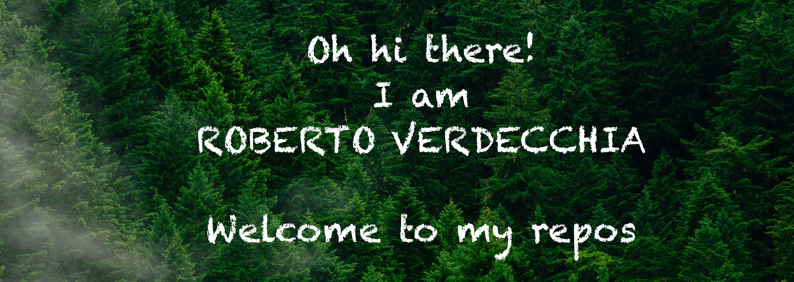

<!-- markdownlint-disable-next-line -->

<h1 align="center">Oh hi there! 👋 </h1>

     
    I am <b>Roberto Verdecchia </b>   
    I'm a  <b>Postodoctoral research associate </b> of the <a href="https://s2-group.github.io/">Software and Sustainability group</a>
     at the <a href="https://vu.nl/en">Vrije Universiteit Amsterdam</a>. 
    My research interest focuses on research interests focus on  the adoption of <b>empirical methods</b>  to improve <b>software development</b> and <b>system evolution</b>,  with particular interest in the fields of  <b>technical debt</b>📈  <b>software architecture</b>🏠  software <b>energy sustainability 🌱</b>  and <b>software testing</b>🐞 
    If you are more interested in me and my research, rather than my code,  I would suggest you to browse my 
  <a href="https://robertoverdecchia.github.io">personal website🦊</a> or my <a href="https://robertoverdecchia.github.io/publications">publication page📚</a>
  
 

  <!--

  
<h3 align="center"><b>Languages and Tools<b>
 

-->
  

 <b>Get in touch with me 📫 </b> 
  <!--
   - [Linkedin](www.linkedin.com/in/sneha-agarwal-217a55200)
   - [Twitter](https://twitter.com/robertoverdecchia).
  -->
  
 
 

  

<!--
  
 -->

 
<!-- -->

  

<!-- 

 
-->

